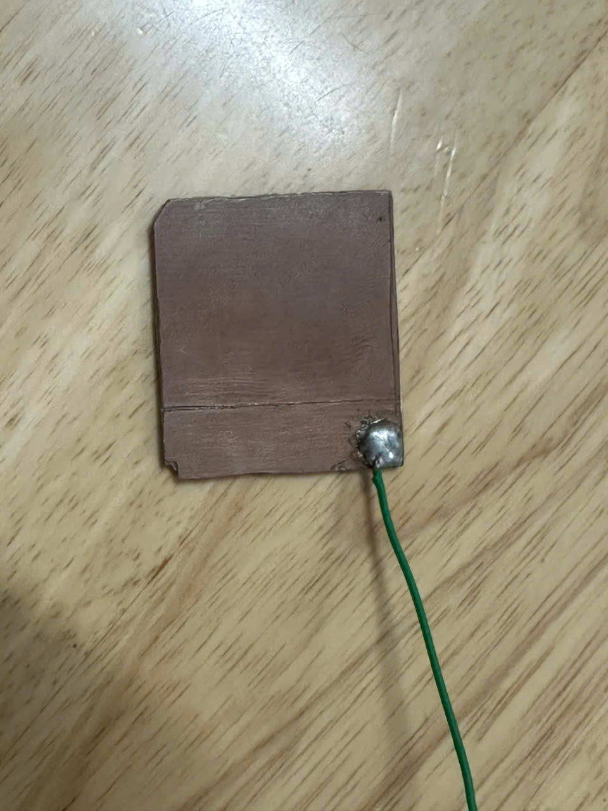
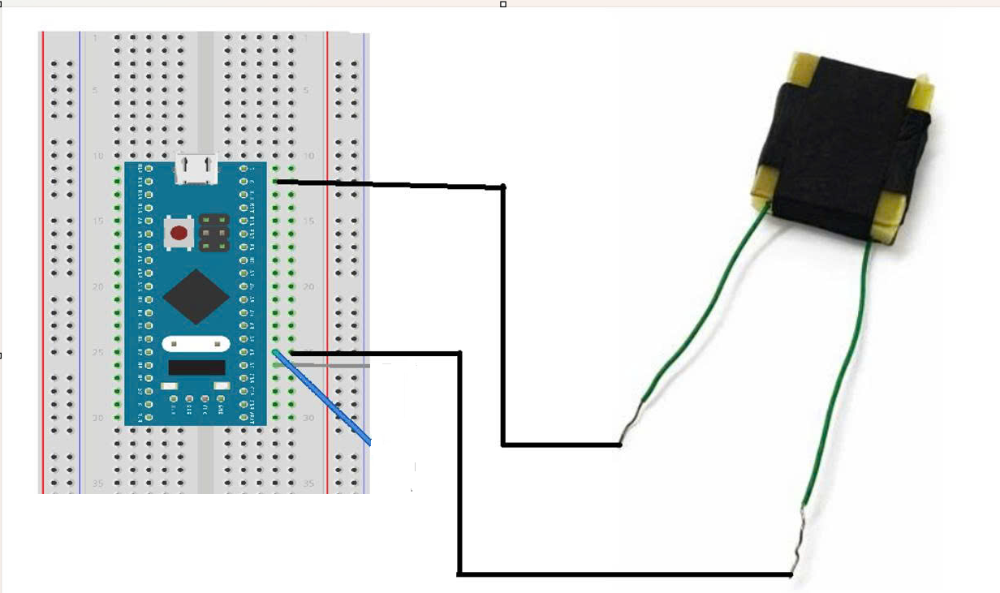
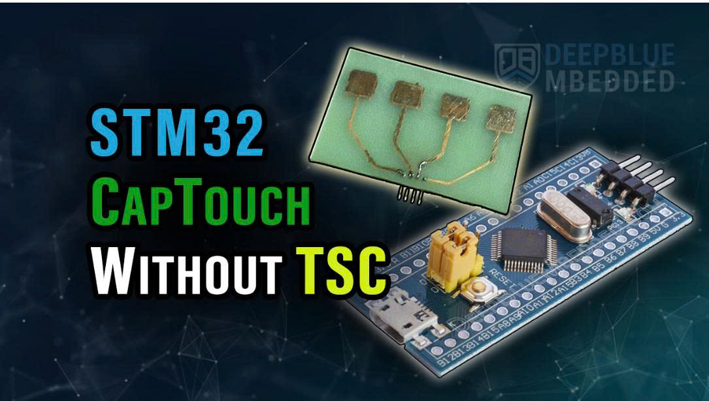
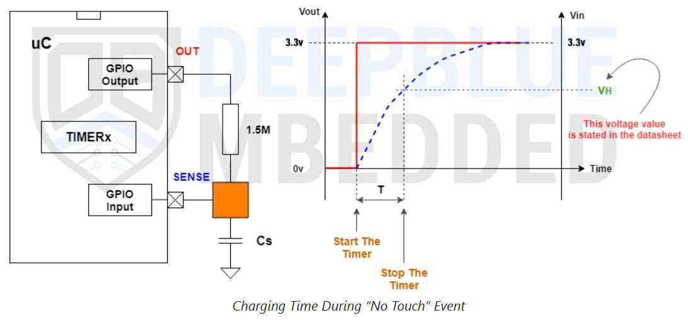
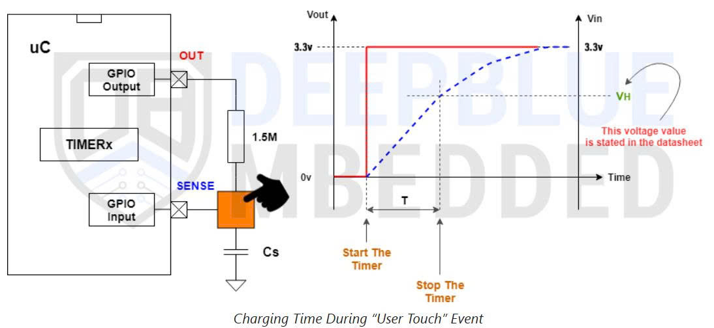
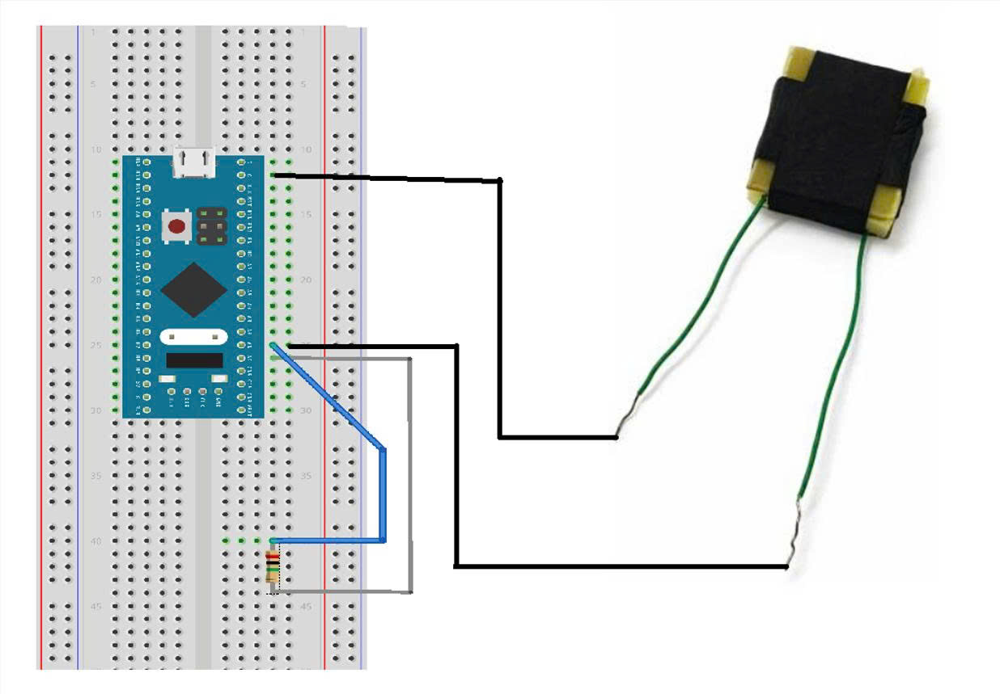

# Báo cáo tiến độ nghiên cứu ngày 16/05/2026
## A. Công việc đã làm
- Ứng dụng làm cảm biến xúc giác điện dung dựa trên ADCTouchSensor
- Ứng dụng làm cảm biến xúc giác điện dung bằng RC+Timer
## B. Khó Khăn
## C. Báo cáo chi tiết
### 1. Ứng dụng làm cảm biến xúc giác điện dung dựa trên ADCTouchSensor

#### a. Link tài liệu tham khảo: https://github.com/arpruss/ADCTouchSensor
##### Tài liệu này giới thiệu về ADCTouchSensor, một thư viện mã nguồn mở giúp tạo ra các cảm biến chạm điện dung mà không cần lắp đặt thêm linh kiện điện tử bên ngoài
##### Công cụ này tận dụng cấu trúc mạch nội bộ của các dòng vi điều khiển như AVR và STM32 để đo đạc sự thay đổi điện năng chỉ với một chân cắm duy nhất
##### Bên trong bộ chuyển đổi Analog sang Digital (ADC) của vi điều khiển (như Arduino AVR hay STM32) có một tụ điện rất nhỏ gọi là tụ lấy mẫu và giữ
##### Bằng cách tối ưu hóa việc sử dụng các chân chức năng sẵn có, người dùng có thể đạt được độ phân giải tín hiệu tốt trong khi tiết kiệm tối đa tài nguyên phần cứng. Thư viện cung cấp các hàm lập trình đơn giản để hiệu chuẩn và đọc dữ liệu
##### Các hàm trong thư viện:
###### Hàm khởi tạo:
```cpp
ADCTouchSensor::ADCTouchSensor(int pin, int sacrificialPin, unsigned delayTimeMicroseconds) {
    ...
    touchPin = pin;                      
    touchDigitalPin = pin;               
    reference = 0;                       
    groundedPin = sacrificialPin;        
    delayTime = delayTimeMicroseconds;   
    if (sacrificialPin < 0) {
#if defined(ADCTOUCH_STM32_GROUND_CHANNEL) || defined(ARDUINO_ARCH_AVR)
        valid = true;
#else
        valid = false;
#endif    
    }
    else {
        valid = true;
    }
}
```
- Do các bản cập nhật mới của bộ Core STM32duino đã loại bỏ hàm can thiệp thanh ghi nội bộ (adc_read), hệ thống bắt buộc phải sử dụng một chân vật lý phụ (sacrificialPin) để tạo đường xả điện
###### Hàm xả tụ nội bộ

```cpp
inline void ADCTouchSensor::groundPortable() {
    pinMode(groundedPin, OUTPUT); // HARDWARE ISSUE: ensure no short occurs
    digitalWrite(groundedPin, 0);
    if (delayTime > 0)
        delayMicroseconds(delayTime);
    analogRead(groundedPin);
}
```
- Chuyển chân hiến tế thành cực xuất tín hiệu
- Xuất mức logic LOW(0) ra chân hiến tế
- Ép tụ ADC nội bộ đọc mức 0V nhờ hàm analogRead()

###### Hàm readRaw()
- Hàm này thực hiện trọn vẹn chu trình đo
  
```cpp
int ADCTouchSensor::readRaw(unsigned samples) {
    if (!valid)
        return -10000;
    int32_t total = 0;
    for (unsigned i=0; i<samples; i++) {
        pinMode(touchDigitalPin, INPUT_PULLUP);
        if (groundedPin >= 0) {
            groundPortable();
        }
.....
        pinMode(touchDigitalPin, INPUT_ANALOG);
        total += analogRead(touchPin);
    }
    return total / ADCTOUCH_DIVIDER / samples;
}
```
- samples : số lượng mẫu được sử dụng để lấy trung bình cộng, giúp tăng độ chính xác và lọc các nhiễu điện từ vi mô.
- Sạc điện cho bản cực
- Xả tụ nội bộ về 0
- Ngừng sạc, tiến hành đọc lượng điện tích
- Lấy trung bình cộng theo số mẫu và hệ số chia để tránh tràn số trên STM32

##### Hàm begin()

- Được gọi trong khối khởi tạo setup(), tiến hành đo điện dung lúc tĩnh để ra một giá trị môi trường tĩnh lặng .
```cpp
bool ADCTouchSensor::begin(unsigned samples) {
    if (valid) {
        reference = readRaw(samples);
        return true;
    }
    else
        return false;
}
```

##### Hàm read()
- Được gọi liên tục trong khối lặp loop(), lấy kết quả từ readRaw() tại thời điểm thực tế trừ đi mức reference được lấy ở hàm begin().

```cpp
int ADCTouchSensor::read(unsigned samples) {
    if (valid)
        return readRaw(samples) - reference;
    else
        return -10000;
}
```
#### b. Cấu trúc phần cứng
- 2 miếng PCB đặt song song như 2 bản tụ và 1 lớp điện môi đàn hồi.
- Miếng PCB được hàn dây như sau:
<div align="center">



</div>
- Sơ đồ nguyên lí:

<div align="center">



</div>

#### c. Video kết quả thử nghiệm

https://github.com/user-attachments/assets/cde1463b-5d46-408b-880b-1346305406f7

### 2. Ứng dụng làm cảm biến xúc giác điện dung bằng RC+Timer
#### a. Link tài liệu tham khảo: https://deepbluembedded.com/stm32-capacitive-touch-sensing-without-tsc/

<div align="center">



</div>

##### Bài viết này hướng dẫn phương  pháp cảm biến chạm điện dung trên dòng vi điều khiển STM32 không tích hợp sẵn bộ giải mã cảm ứng phần cứng (TSC).
##### Sử dụng mạch RC kết hợp Timer, sử dụng điện trở có trị số lớn và hai chân GPIO  để đo lường điện dung khi có tác động.
##### Nguyên lí hoạt động
- Các phím cảm ứng tự điện dung vốn có sẵn một mức điện dung nhất định. Khi một vật thể nối đất (như ngón tay con người) đi vào phạm vi trường tĩnh điện của phím, nó sẽ làm tăng tổng điện dung của cảm biến thêm một lượng rất nhỏ, thường chỉ khoảng 10-20pF
- Vì giá trị điện dung cần đo là rất nhỏ, mạch cần làm chậm quá trình sạc để có thể theo dõi được. Hệ thống sẽ sử dụng hai chân GPIO của vi điều khiển: một chân đóng vai trò phát tín hiệu (Drive pin) và một chân nhận tín hiệu đầu vào (Sense/Input pin) được kết nối với cảm biến. Giữa hai chân này được đặt một điện trở có giá trị lớn
- Khi hệ thống cấp một tín hiệu mức cao (logic 1 hoặc 3.3V) từ chân phát, bộ timer sẽ được khởi động để đếm cùng lúc. Chân nhận tín hiệu sẽ chỉ đọc được mức logic 1 sau khi tụ điện đã sạc đến ngưỡng điện áp nhất định. Ngay khi chân nhận đọc được mức logic 1, timer sẽ dừng đếm.
- Thời gian sạc tỷ lệ thuận trực tiếp với điện dung của cảm biến. Điện dung càng lớn thì chân nhận càng mất nhiều thời gian để đạt đến điện áp ngưỡng. Do đó, khi người dùng chạm vào cảm biến làm điện dung tăng lên, thời gian sạc sẽ kéo dài hơn và số lượng xung đếm (ticks) của timer sẽ tăng lên.
##### Quy trình đo lường
- Trạng thái không chạm: Khi chân Driver phát tín hiệu mức cao (3.3V), chân Sense sẽ đọc được mức 1 sau một khoảng thời gian nạp điện nhất định. Timer sẽ đo số lượng "ticks" từ lúc bắt đầu nạp đến khi chân Sense đạt ngưỡng logic 1.

<div align="center">



</div>

- Trạng thái có chạm: Khi người dùng chạm vào cảm biến, điện dung tăng lên dẫn đến thời gian nạp điện dài hơn. Số lượng "ticks" của Timer sẽ tăng lên rõ rệt so với trạng thái bình thường. Phần mềm sẽ dựa vào sự gia tăng này để xác nhận sự kiện chạm.

<div align="center">



</div>

#### b. Cấu trúc phần cứng
- 2 miếng PCB đặt song song như 2 bản tụ và 1 lớp điện môi đàn hồi.
- Miếng PCB được hàn dây như sau:

<div align="center">


</div>

- Lớp điện môi đàn hồi, dễ nén khi chịu lực, cho phép khoảng cách giữa hai bản cực thay đổi theo lực tác động.
#### c. Nguyên lí điện dung
- Khi có lực tác động, lớp điện môi đàn hồi sẽ biến dạng làm cho 2 bản tụ gần nhau hơn khiến điện dung tăng.

$$
C = \frac{\varepsilon S}{d}
$$

#### d. Sơ đồ đấu dây

<div align="center">



</div>

##### Linh kiện sử dụng
- Stm32f103c8t6
- Trở : 3M

#### e. Quá trình đo 
##### Sự thay đổi điện dung của cảm biến được xác định gián tiếp thông qua RC + Timer
##### Nguyên lí hoạt động
- Phương pháp đo dựa trên nguyên lý nạp điện của mạch RC. Với điện trở R cố định và điện dung C của cảm biến thay đổi, hằng số thời gian của mạch là:

$\tau = R \cdot C$

- Khi điện dung thay đổi, thời gian điện áp tại nút đo tăng từ mức thấp lên đến ngưỡng logic của vi điều khiển cũng thay đổi theo
- Thay vì đo trực tiếp giá trị điện dung (Giá trị bé khó đo), hệ thống sẽ đo thời gian nạp RC, từ đó suy ra sự biến thiên của điện dung. Giá trị thời gian này được xem là đại lượng trung gian phản ánh mức độ biến dạng của cảm biến.
##### Hệ thống sử dụng hai chân GPIO của vi điều khiển STM32:
- Một chân dùng để tạo tín hiệu nạp/xả cho mạch RC
- Một chân dùng để theo dõi mức điện áp tại nút đo
##### Các bước thực hiện
###### Đưa các chân liên quan về mức thấp để xả hết điện tích còn lại trong cảm biến, đưa hệ thống về trạng thái ban đầu trước khi đo
```c
HAL_GPIO_WritePin(GPIOA, GPIO_PIN_0, GPIO_PIN_RESET);
PA1_As_Output_Low();
HAL_Delay(1);
```
- Trong đó hàm:
```c
void PA1_As_Output_Low(void)
{
    GPIO_InitTypeDef GPIO_InitStruct = {0};

    GPIO_InitStruct.Pin = GPIO_PIN_1;
    GPIO_InitStruct.Mode = GPIO_MODE_OUTPUT_PP;
    GPIO_InitStruct.Pull = GPIO_NOPULL;
    GPIO_InitStruct.Speed = GPIO_SPEED_FREQ_LOW;
    HAL_GPIO_Init(GPIOA, &GPIO_InitStruct);

    HAL_GPIO_WritePin(GPIOA, GPIO_PIN_1, GPIO_PIN_RESET);
}
```
Dùng để xả điện tích chân PA1. 
###### Sau khi xả xong, chân đo được chuyển sang chế độ input để theo dõi sự thay đổi điện áp tại nút đo
```c
void PA1_As_Input(void)
{
    GPIO_InitTypeDef GPIO_InitStruct = {0};

    GPIO_InitStruct.Pin = GPIO_PIN_1;
    GPIO_InitStruct.Mode = GPIO_MODE_INPUT;
    GPIO_InitStruct.Pull = GPIO_NOPULL;
    HAL_GPIO_Init(GPIOA, &GPIO_InitStruct);
}
```
- PA1 trở thành chân quan sát mức điện áp tăng lên trong quá trình nạp
###### Sau khi hoàn tất bước xả và cấu hình chân đo, chân điều khiển được đưa lên mức cao để bắt đầu quá trình nạp của mạch RC 
```c
HAL_GPIO_WritePin(GPIOA, GPIO_PIN_0, GPIO_PIN_SET);
```
- PA0 lên mức HIGH
- Mạch RC bắt đầu nạp điện
###### Trước khi bắt đầu nạp, Timer được reset về 0 để làm mốc thời gian cho lần đo hiện tại.
```c
__HAL_TIM_SET_COUNTER(&htim2, 0);
```
###### Trong khi mạch đang nạp, chương trình liên tục kiểm tra trạng thái logic tại chân đo. Khi điện áp tại PA1 đạt đến ngưỡng được vi điều khiển nhận là logic 1, quá trình đo kết thúc.
```c
while(HAL_GPIO_ReadPin(GPIOA, GPIO_PIN_1) == GPIO_PIN_RESET)
{
    if(__HAL_TIM_GET_COUNTER(&htim2) > timeout)
    {
        HAL_GPIO_WritePin(GPIOA, GPIO_PIN_0, GPIO_PIN_RESET);
        return timeout;
    }
}
```
- PA1 vẫn đang ở mức thấp thì tiếp tục chờ 
- PA1 chuyển HIGH thì vòng lặp dừng, điều đó cho biết điện áp tại nút đo đã đạt ngưỡng logic của STM32
- Biến timeout tránh chương trình bị treo vô hạn nếu tín hiệu không lên được mức HIGH
###### Sau khi phát hiện PA1 lên mức logic 1, chương trình kéo PA0 xuống thấp để kết thúc quá trình nạp.
```c 
HAL_GPIO_WritePin(GPIOA, GPIO_PIN_0, GPIO_PIN_RESET);
```
- Đồng thời chương trình đọc giá trị của timer. Giá trị này là thời gian nạp RC
```c
return __HAL_TIM_GET_COUNTER(&htim2);
```
- Số đếm timer tại thời điểm PA1 vừa lên HIGH là thời gian nạp RC
###### Để giảm ảnh hưởng của nhiễu, phép đo được tính nhiều lần liên tiếp sau đó lấy trung bình các kết quả
```c
float Measure_RC_Time_US_Avg(uint16_t n)
{
    uint32_t sum = 0;

    for(uint16_t i = 0; i < n; i++)
    {
        sum += Measure_RC_Once_US();
    }

    return (float)sum / n;
}
```

#### f. Thí nghiệm đo điện dung C với các vật liệu và kích thước khác nhau
Thông số thí nghiệm: https://docs.google.com/spreadsheets/d/12S2Da0dxASqYnYccrnSx9N-UnDkQImf4RA5wJKK-nlw/edit?usp=sharing
